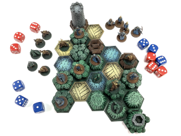

# Pocket-Tactics

## Die Legion des Hochkönigs gegen die Stämme des Dunkelwaldes

Willkommen bei Pocket-Tactics, einem rasanten, modularen Strategiespiel, das Sie überallhin mitnehmen und spielen können! Diese Set enthält zwei Fraktionen. Für ein gewöhnliches Zwei-Spieler-Spiel benötigen Sie folgende Einheiten und Geländekacheln.

### Legion des Hochkönigs
+ Rekrut x 3
+ Bogenschütze x 2
+ Speerkämpfer x 2
+ Schwertkämpfer x 2
+ Kriegerin x 1
+ Magier x 1
+ Stützpunkt Caer x 1
+ Feld x 4
+ Hügel x 4
+ Dorf x 2 

### Stämme des Dunkelwaldes
+ Späher des Dunkelwaldes x 3
+ Plünderer des Dunkelwaldes x 2
+ Moloch des Dunkelwaldes x 2
+ Waldhexe x 2
+ Verfluchter Waldläufer x 1
+ Druide x 1
+ Stützpunkt Druidenzirkel x 1
+ Wasser x 3
+ Wald x 7

## Spielvorbereitung
+   Die Spieler wählen jeweils eine Fraktion. Legen Sie anschließend sowohl die zwei Stützpunkte (Caer und Druidenkreis) als auch alle Einheiten an die Seite des Spielfelds.
+	Geben Sie alle Geländekacheln in einen Beutel.
+	Würfeln Sie, um zu bestimmen, wer der erste Spieler ist.
+	Der erste Spieler legt seinen Stützpunkt vor sich auf das Spielfeld, zieht eine Geländekachel aus dem Beutel und legt die Kachel an eine nach außen gerichtete Seite seines Stützpunkts. Das sind die drei Seiten, die vom ersten Spieler weg zeigen.
+	Spieler 2 zieht eine Kachel und legt sie auf die gleiche Weise ab. 
Wie bei bei der ersten Kachel, muss auch die zweite an einer vom ersten Spieler abgewandten Kachelseite platziert werden. 
+	Legen Sie nun abwechselnd neue Geländekacheln auf diese Weise ab. Das Spielfeld sollte sich in Richtung des zweiten Spielers auffächern und ausdehnen.
+	Sobald alle Geländekacheln im Spiel sind, platziert der zweite Spieler seinen Stützpunkt so weit wie möglich von dem ersten Stützpunkt entfernt. Der Stützpunkt muss hierbei genau die gleiche Anzahl von Geländekacheln berühren. Wenn beispielsweise der Stützpunkt des ersten Spielers mit zwei Kacheln verbunden ist, muss der Stützpunkt des zweiten Spielers an die am weitesten entfernte Stelle gelegt werden, an der er ebenfalls mit zwei Kacheln verbunden ist.
+ Jedes der Charaktermodelle wird als eine Einheit bezeichnet. Beginnend mit dem ersten Spieler, stellen die Spieler abwechselnd Einheiten auf die Geländekacheln, die ihrem Stützpunkt am nächsten liegen. Jeder Spieler bringt zunächst drei Einheiten ins Spiel. Die restlichen Einheiten werden am Rand des Spielfelds platziert und bilden die Reserve.

## Spielablauf
Der erste Spieler beginnt das Spiel. In seinem Zug kann der Spieler entweder eine Einheit bewegen, eine neue Einheit aufstellen oder einen Angriff durchführen.  

### Bewegen
Eine Einheit kann sich auf eine benachbarte unbesetzte Kachel bewegen. Einheiten können eine von einer befreundeten Einheit besetzte Kachel "überspringen", um eine unbesetzte Kachel zu erreichen. Einige Einheiten, wie Speerkämpfer und der Druide, haben spezielle Fähigkeiten, die die Bewegung beeinflussen. Diese Fähigkeiten sind auf der Charakterkarte der jeweiligen Einheit aufgeführt.

#### Gefahren
Gefahren sind meist Einflüsses des Geländes, die eine Einheit auch außerhalb eines Angriffs besiegen oder andere negative Auswirkungen haben können. Wenn Sie sich in ein gefährliches Gelände bewegen oder einen Nahkampfangriff dorthin durchführen, wirkt die Gefahr und muss geprüft werden. Bei einer Gefahr durch Wasser wird sofort gewürfelt und bei einem Wurfe von 1 bis 3 ist die Einheit besiegt. Entfernen Sie die Einheit vom Spielfeld und übergeben Sie sie ihrem Gegner. Die Einheit kommt ins Gefangenenlager.
Wenn Sie über einen Verbündeten auf einem Gefahrenfeld springen, wird keine Gefahrenprüfung durchgeführt. Eine Einheit, die in einem Gefahrenfeld Geländevorteil hat, ist immun gegen den Gefahreneffekt (allerdings gibt es in diesem Set keine Einheiten, auf die dies zutrifft).

### Angriff
Eine Einheit attackiert einen Gegner, indem sie einen "Angriff" deklariert. Es gibt zwei Arten von Angriffen: Nahkampfangriffe und Fernkampfangriffe.

#### Nahkampf
Um einen Nahkampfangriff durchzuführen, bewegt sich die angreifende Einheit auf ein angrenzendes gegnerisches Spielfeld. Wenn dort kein Platz ist, stellen Sie die Einheiten einfach vorerst zur Seite. Für die angreifende Einheit zählt das gegnerische Gelände als Standort und damit gelten die entsprechenden Geländevorteile. Der Angreifer erklärt nun Nahkampf oder Magie, und jeder Spieler würfelt eine Anzahl von roten Angriffs- und blauen Verteidigungswürfeln, deren Anzahl auf den Angriffs- und Abwehrwerten der Einheiten basieren. Diese Würfe repräsentieren den Angriff des Angreifers und den gleichzeitigen Gegenangriff des Verteidigers.

#### Auswertung der Würfel
Ordnen Sie den Angriffswürfeln die Abwehrwürfel vom höchsten zum niedrigsten Wert auf jeder Seite zu. 
Vergleichen Sie nun die Würfelpaare. Ist der Abwehrwurf niedriger als der Angriffswurf, so ist die gegnerische Einheit besiegt und es wird nicht weiter verglichen. Wenn der Abwehrwurf gleich oder höher dem Angriffwurfs ist, so ist der Angriffswurf fehlgeschlagen und das nächste Würfelpaar wird verglichen. Falls einem Angriffswurf kein Abwehrwurf entgegengesetzt werden kann, so ist die Einheit ebenfalls besiegt.
Es kann passieren, dass sich beide Einheiten gegenseitig besiegen. Es ist auch möglich, dass der Kampf in einer Pattsituation endet. 
Wenn eine Einheit besiegt ist, wird sie vom Spielfeld entfernt und wandert ins Gefangenenlager des Gegners. 
Wenn die angreifende Einheit gesiegt und überlebt hat, wird sie nun das Gelände besetzen. Falls der Angriff in einer Pattsituation endet, kehrt der
Angreifer auf das Feld zurück, auf dem er sich vor dem Angriff befand. Die Rückkehr löst keinen Gefahrenprüfung aus.

#### Fernkampf
Bei einem Fernangriff kann die angreifende Einheit eine gegnerische Einheit in einem angrenzenden Spielfeld mit Fernkampfwaffen oder Magie bekämpfen. Wie bei Nahkämpfen muss die verteidigende Einheit, die vom Angreifer gewählte Angriffsart abwehren. Fernkämpfe werden genauso behandelt wie Nahkämpfe, mit dem Unterschied, dass der Angreifer sich nicht bewegt, wenn er gewinnt.
Ein Verteidiger kann nur dann einen Gegenangriff durchführen, wenn er eine ähnliche Spezialfähigkeit hat und damit den Angreifer erreichen kann.
Einige Einheiten, beispielsweise Bogenschützen, verwenden spezielle Fähigkeiten, um Fernangriffe aus noch größerer Entfernung durchzuführen. Ein solche Fernkampfangriff, der sich über ein Feld hinaus erstreckt, darf nicht durch leere Räume erfolgen, in denen sich keine Geländekachel befindet.

### Vorteil
Einige Fähigkeiten und Situationen erlauben es den Einheiten einen oder mehrere Würfel neu zu würfeln, bevor ein Angriff abgewickelt wird.
Wenn Einheiten Wiederholungswürfe zur Verfügung haben, würfeln die Spieler abwechselnd beginnend mit dem Angreifer, es sei denn eine Spezialfähigkeit bestimmt etwas anderes. 
Wiederholungswürfe, die durch besondere Fähigkeiten gewährt werden, müssen zuerst verwendet werden und gelten nicht als Vorteilswürfe. 
Vorteilswiederholungen entstehen durch Geländervorteil und Unterstützung befreundeter Einheiten. Die Vorteilswiederholungen betreffen nur die Würfe der eigenen Einheit, nicht die des Gegners.

#### Geländervorteil
Auf der Charakerkarte jeder Einheit ist ein Gelände aufgeführt, auf dem die Einheit mit Vorteil kämpfen kann. Ein Angriff auf dieses Gelände gewährt dem Angreifer einen Wiederholungswurf. Ein Fernkampfangriff von einem solchen Gelände gewährt einen Wiederholungswurf. Das Verteidigen auf einem vorteilhaften Gelände wird entsprechend mit einem Wiederholungswurf erleichtert.

#### Unterstützung
An einen Kampf angrenzende Einheiten bringen Vorteile. Wenn der Angreifer Verbündete in der Nähe des Ziels hat, gewähren sie jeweils einen Wiederholungswurf. Wenn der Verteidiger Verbündete auf
angrenzenden Felder hat, gewähren diese jeweils einen Wiederholungswurf. Benachbarte verbündete Stützpunkte gewähren zwei Wiederholungswürfe.

### Stützpunkte
Stützpunkte können keine Einheiten besiegen. Wenn sie angegriffen werden, verteidigen sich immer mit Abwehrwürfeln. Benachbarte verbündete Einheiten unterstützen ihren Stützpunkt. 
Einheiten dürfen die Stützpunkte nicht wie andere Felder besetzen und bekommen keinen Vorteil, wenn sie einen Angriff in der Nachbarschaft durchführen.

## Aufstellen von Einheiten
Anstatt sich zu bewegen oder anzugreifen, kann ein Spieler eine Einheit aus seiner Reserve holen und sie auf ein unbesetztes Feld neben seinem Stützpunkt platzieren. Das Aufstellen einer Einheit auf Wasser oder einem anderen Gelände mit einer Gefahr löst keine Gefahrenprüfung aus. Ein Spieler kann eine Einheit zurück in seine Reserven beordern, indem er die Einheit auf seinen Stützpunkt bewegt.

## Siegbedingungen
Um zu gewinnen, muss ein Spieler entweder die gesamte gegnerische Armee gefangen nehmen oder deren Stützpunkt besiegen.

## Sonstiges
### Auf Zeit spielen
Wenn ein Spieler mehrere sinnlose Züge macht, um Zeit zu gewinnen oder seinen Gegner dazu zu bringen, etwas Unüberlegtes zu tun, nennt man das "auf Zeit spielen". Das ist nicht erlaubt, es sei denn der Spieler hat nur noch zwei oder weniger Einheiten. Wenn beide Spieler an diesem Punkt sind, hat nur der Spieler mit den niedrigsten Gesamtkosten das Recht, auf Zeit zu spielen.

### Kosten für Einheiten
Die Kosten einer Einheit werden auf ihrer Charakterkarte genannt und basieren auf der Gesamteffektivität der Einheit. Im Standardspiel hat jede Fraktion 125 Punkte an Einheiten.

### Lizenz
Diese Arbeit unterliegt den Bestimmungen einer
[Creative Commons Namensnennung-Nicht kommerziell-Share Alike 4.0 International-Lizenz](https://creativecommons.org/licenses/by-nc-sa/4.0/deed.de)
